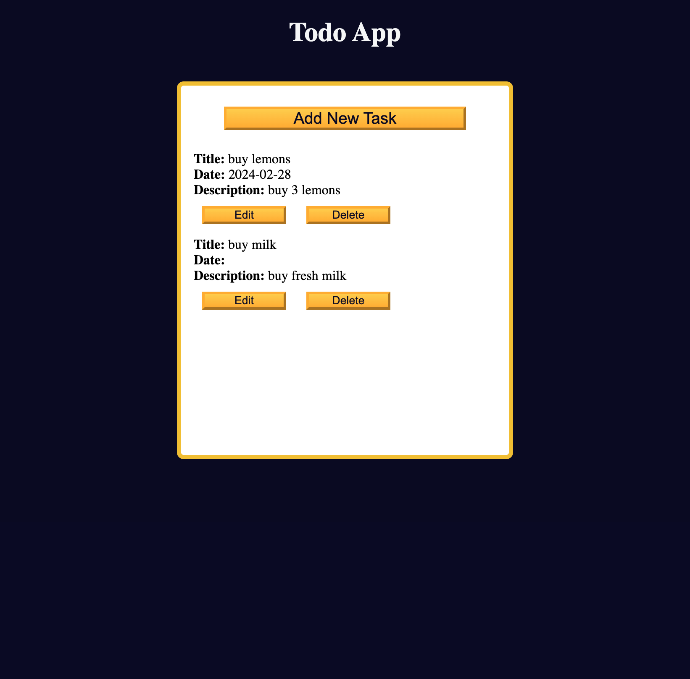

# freeCodeCamp - To-Do App

The freeCodeCamp To-Do App serves as an exemplary case study in applying fundamental web development principles to create a practical and functional application. In this TODO application, I learned how to handle form inputs, manage local storage, perform CRUD (Create, Read, Update, Delete) operations on tasks, implement event listeners, and toggle UI elements.

### The challenge

Users should be able to:

- Create Tasks: Users should have the ability to create new tasks by entering a title and optionally providing additional details such as a due date or description.
- Edit Tasks: Users should be able to modify existing tasks, including updating the task title, changing the due date, or revising the task description.
- Delete Tasks: Users should be able to delete tasks from their to-do list when they are no longer needed or relevant.

### Link

- Live Site URL: (https://olenahelena.github.io/To-Do_App/)

### Screenshot

